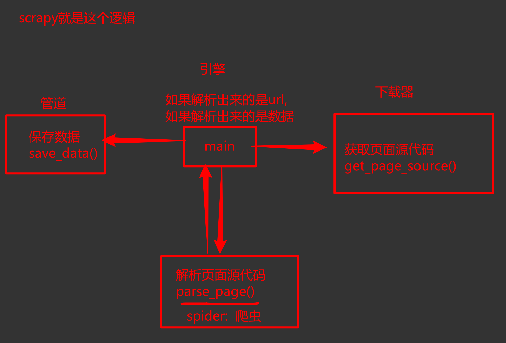
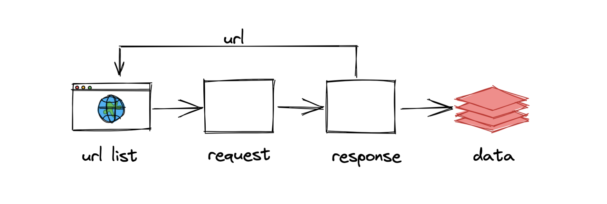
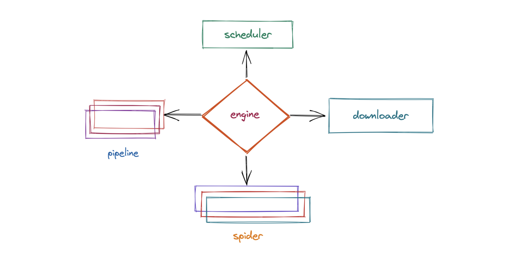
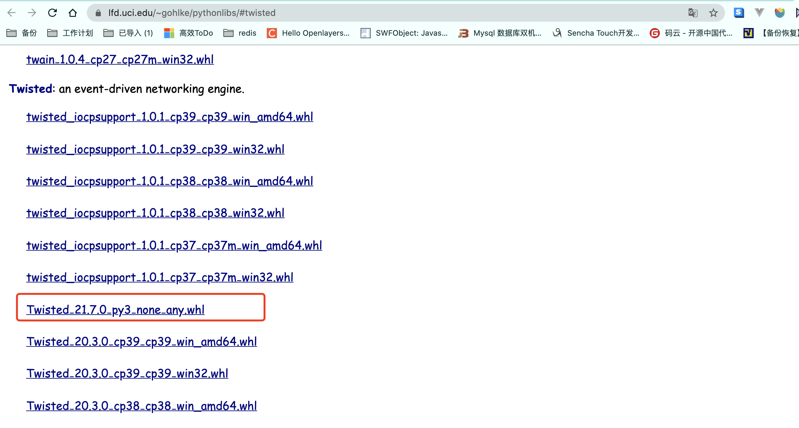

# Scrapy 基本介绍与使用


## 一, 爬虫工程化

​		在之前的学习中我们已经掌握了爬虫这门技术需要的大多数的技术点, 但是我们现在写的代码还很流程化, 很难进行商用的. 想要我们的爬虫达到商用级别, 必须要对我们现在编写的爬虫代码进行大刀阔斧式的重组, 已达到工程化的爬虫. 何为工程化, 就是让你的程序更加的有体系, 有逻辑, 更加的模块化. 

​		就好比, 我们家里以前做过鞋子, 我妈妈给我做鞋, 她需要从画图纸到裁剪到最后的缝合, 一步一步的完成一双鞋子的制作. 这种手工鞋子如果每年做个几双, 没问题. 我妈妈辛苦一点, 也能搞定. 但是, 如果现在我想去售卖这个鞋子. 再依靠妈妈一双一双的缝制. 你不赔死, 也得让你妈打死. 为什么? 第一, 产能跟不上. 一个人的力量是有限的, 第二, 一个人要完整的把制作鞋子的工艺从头搞到尾. 就算你想招人分担一下. 貌似也不好找这样厉害的手艺人. 怎么办? 聪明的你可能已经想到了. 从头到尾完成一双鞋的人不好找. 那我就把这个工艺过程分开. 分成4份, 画图, 裁剪, 缝合, 验收.  招4个人. 每个人就负责一小部分. 并且这一小部分是很容易完成的. 最终只要有一个人(我)来做一个总指挥. 我的制鞋小工厂就建起来了. 

​		上述逻辑同样适用于我们的爬虫, 想想, 到目前为止, 我们所编写的爬虫我们都是从头到尾的每一步都要亲力亲为. 这样做固然有其优点(可控性更好), 但是各位请认真思考. 这样的代码逻辑是不能形成批量生产的效果的(写100个爬虫). 很多具有共通性的代码逻辑都没有进行重复利用. 那我们就可以考虑看看, 能不能把一些共性的问题(获取页面源代码, 数据存储), 单独搞成一个功能. 如果我们把这些功能单独进行编写. 并且产生类似单独的功能模块, 将大大的提高我们爬虫的效率.  已达到我们爬虫工程化开发的效果. 

​		爬虫工程化: 对爬虫的功能进行模块化的开发. 并达到可以批量生产的效果(不论是开发还是数据产出) 


## 二, Scrapy简介

​		Scrapy到目前为止依然是这个星球上最流行的爬虫框架. 摘一下官方给出对scrapy的介绍

```
An open source and collaborative framework for extracting the data you need from websites.

In a fast, simple, yet extensible way.
```

​		scrapy的特点: 速度快, 简单, 可扩展性强. 

​		Scrapy的官方文档(英文): https://docs.scrapy.org/en/latest/


神马叫框架: 按照框架本身设计的逻辑. 往里面填写内容就可以了. 


学习其他框架的时候. 切忌. 不要去直接上来去抠它的源码 .

先学会如何使用(怎么往里填窟窿). 反着去看他的源代码. 理解起来就容易了


## 三, Scrapy工作流程(重点)

```python
# 伪代码, 只为说明
def get_page_srouce():
	resp = requests.get(xxxxx)
	return resp.text | resp.json()
	
def parse_source():
	xpath, bs4, re
    return data
	
def save_data(data):
	txt, csv, mysql, mongodb
	
def main():  # 负责掌控全局
    # 首页的页面源代码
	ret = get_page_source()  # 获取页面源代码, 发送网络请求
	data = parse_source(ret)  # 去解析出你要的数据
	# 需要继续请求新的url
	while: 
		# 详情页 
		ret = get_page_source()  # 获取页面源代码, 发送网络请求
		data = parse_source(ret)  # 去解析出你要的数据
		save_data(data) # 负责数据存储
        
        # 详情页如果还有分页.
        # ...继续上述操作. 
      
if __name__ == '__main__':
	main()

```




​		之前我们所编写的爬虫的逻辑: 



​		scrapy的工作流程: 




整个工作流程, 

    1. 爬虫中起始的url构造成request对象, 并传递给调度器. 
    2. `引擎`从`调度器`中获取到request对象. 然后交给`下载器`
    3. 由`下载器`来获取到页面源代码, 并封装成response对象. 并回馈给`引擎`
    4. `引擎`将获取到的response对象传递给`spider`, 由`spider`对数据进行解析(parse). 并回馈给`引擎`
    5. `引擎`将数据传递给pipeline进行数据持久化保存或进一步的数据处理. 
   6. 在此期间如果spider中提取到的并不是数据. 而是子页面url. 可以进一步提交给调度器, 进而重复`步骤2`的过程


```python
# 伪代码, 只为说明
def get_page_srouce(url, method):
    if method == get：
        resp = requests.get(xxxxx)
        return resp.text | resp.json()
	
def parse_source():
	xpath, bs4, re
	
def save_data(data):
	txt, csv, mysql, mongodb
	
def main():  # 负责掌控全局->为了你理解
	# 主页
    req = spider.get_first_req()
    while 1:
        scheduler.send(req)
        next = scheduler.next_req()
        sth = downloader.get_page_source(next)
        data = spider.parse(sth)
        if data is 数据:
        	pipeline.process_item(data)
            
if __name__ == '__main__':
	main()

```


上述过程中一直在重复着几个东西, 

1. 引擎(engine)

    scrapy的核心, 所有模块的衔接, 数据流程梳理.

2. 调度器(scheduler)

    本质上这东西可以看成是一个集合和队列. 里面存放着一堆我们即将要发送的请求. 可以看成是一个url的容器. 它决定了下一步要去爬取哪一个url. 通常我们在这里可以对url进行去重操作.  

3. 下载器(downloader) 

    它的本质就是用来发动请求的一个模块. 小白们完全可以把它理解成是一个requests.get()的功能. 只不过这货返回的是一个response对象. 

4. 爬虫(spider)

    这是我们要写的第一个部分的内容, 负责解析下载器返回的response对象.从中提取到我们需要的数据. 

5. 管道(pipeline)

    这是我们要写的第二个部分的内容, 主要负责数据的存储和各种持久化操作. 

经过上述的介绍来看, scrapy其实就是把我们平时写的爬虫进行了四分五裂式的改造. 对每个功能进行了单独的封装, 并且, 各个模块之间互相的不做依赖. 一切都由引擎进行调配. 这种思想希望你能知道--解耦. 让模块与模块之间的关联性更加的松散. 这样我们如果希望替换某一模块的时候会非常的容易. 对其他模块也不会产生任何的影响. 

到目前为止, 我们对scrapy暂时了解这么多就够了. 后面会继续在这个图上进一步展开. 


## 四, Scrapy安装

​	在windows上安装scrapy是一个很痛苦的事情. 可能会出现各种各样的异常BUG. 

scrapy 2.5.1  ->  scrapy-redis（0.7.2）

<span style='font-size:16px;color:red;background:yellow;'>注意, 由于scrapy的升级. 导致scrapy-redis无法正常使用.所以这里我们选择2.5.1这个版本作为学习. 后期各位可以根据scrapy-redis的升级而跟着升级scrapy.</span>

先使用pip直接安装看看报错不

```python
pip install -i https://pypi.tuna.tsinghua.edu.cn/simple scrapy==2.5.1 
pip install scrapy==2.5.1
```

<span style='font-size:1cm;color:red;font-weight:bold;background:yellow;'>如果安装成功, 直接去创建项目即可</span>

如果安装失败. 请先升级一下pip.  然后重新安装scrapy即可. 

最新版本的pip升级完成后. 安装依然失败, 可以根据报错信息进行一点点的调整, 多试几次pip. 直至success. 


如果上述过程还是无法正常安装scrapy, 可以考虑用下面的方案来安装:

 1. 安装wheel

    ```
    pip install wheel
    ```

 2. 下载twisted安装包, https://www.lfd.uci.edu/~gohlke/pythonlibs/#twisted

    

	3. 用wheel安装twisted. 

    ```python
    pip install Twisted‑21.7.0‑py3‑none‑any.whl
    ```

4. 安装pywin32

    ```
    pip install pywin32
    ```

5. 安装scrapy

    ```
    pip install scrapy
    ```

总之, 最终你的控制台输入`scrapy version`能显示版本号. 就算成功了


安装完成后. 请调整OpenSSL的版本. 

错误的版本:

输入命令:  scrapy version --verbose

```python
Scrapy       : 2.5.1
lxml         : 4.9.0.0
libxml2      : 2.9.12
cssselect    : 1.1.0
parsel       : 1.6.0
w3lib        : 1.22.0
Twisted      : 22.4.0
Python       : 3.9.12 (tags/v3.9.12:b28265d, Mar 23 2022, 23:52:46) [MSC v.1929 64 bit (AMD64)]
pyOpenSSL    : 22.0.0 (OpenSSL 3.0.4 21 Jun 2022)  # 此时用的是3.0.4  要降低它的版本
cryptography : 37.0.3
Platform     : Windows-10-10.0.19043-SP0

```

更改方案:

```python
pip uninstall cryptography
pip install cryptography==36.0.2
```

再次输入 scrapy version --verbose

```python
Scrapy       : 2.5.1
lxml         : 4.9.0.0
libxml2      : 2.9.12
cssselect    : 1.1.0
parsel       : 1.6.0
w3lib        : 1.22.0
Twisted      : 22.4.0
Python       : 3.9.12 (tags/v3.9.12:b28265d, Mar 23 2022, 23:52:46) [MSC v.1929 64 bit (AMD64)]
pyOpenSSL    : 22.0.0 (OpenSSL 1.1.1n  15 Mar 2022)  # 正确
cryptography : 36.0.2
Platform     : Windows-10-10.0.19043-SP0

```


## 五, Scrapy实例

​	接下来, 我们用scrapy来完成一个超级简单的爬虫, 目标: 深入理解Scrapy工作的流程, 以及各个模块之间是如何搭配工作的. 

1. 创建项目：

    ```
    scrapy startproject 项目名称
    ```

    示例:

    ```
    scrapy startproject mySpider_2
    ```

    创建好项目后, 我们可以在pycharm里观察到scrapy帮我们创建了一个文件夹, 里面的目录结构如下:

    ```python
    mySpider_2   # 项目所在文件夹, 建议用pycharm打开该文件夹
        ├── mySpider_2  		# 项目跟目录
        │   ├── __init__.py
        │   ├── items.py  		# 封装数据的格式
        │   ├── middlewares.py  # 所有中间件
        │   ├── pipelines.py	# 所有的管道
        │   ├── settings.py		# 爬虫配置信息
        │   └── spiders			# 爬虫文件夹, 稍后里面会写入爬虫代码
        │       └── __init__.py
        └── scrapy.cfg			# scrapy项目配置信息,不要删它,别动它,善待它. 
    
    ```

2. 创建爬虫

    ```python
    cd 文件夹  # 进入项目所在文件夹
    scrapy genspider 爬虫名称 允许抓取的域名范围
    ```

    示例:

    ```
    cd mySpider_2
    scrapy genspider youxi 4399.com
    ```

    效果:

    ```python
    (base) sylardeMBP:第七章 sylar$ cd mySpider_2
    (base) sylardeMBP:mySpider_2 sylar$ ls
    mySpider_2      scrapy.cfg
    (base) sylardeMBP:mySpider_2 sylar$ scrapy genspider youxi http://www.4399.com/
    Created spider 'youxi' using template 'basic' in module:
      mySpider_2.spiders.youxi
    (base) sylardeMBP:mySpider_2 sylar$ 
    ```

    至此, 爬虫创建完毕, 我们打开文件夹看一下. 

    ```python
    ├── mySpider_2
    │   ├── __init__.py
    │   ├── items.py
    │   ├── middlewares.py
    │   ├── pipelines.py
    │   ├── settings.py
    │   └── spiders
    │       ├── __init__.py
    │       └── youxi.py   # 多了一个这个. 
    └── scrapy.cfg
    
    ```

    

3. 编写数据解析过程

    完善youxi.py中的内容. 

    ```python
    import scrapy
    
    class YouxiSpider(scrapy.Spider):
        name = 'youxi'  # 该名字非常关键, 我们在启动该爬虫的时候需要这个名字
        allowed_domains = ['4399.com']  # 爬虫抓取的域.
        start_urls = ['http://www.4399.com/flash/']  # 起始页
    
        def parse(self, response, **kwargs):
            # response.text  # 页面源代码
            # response.xpath()  # 通过xpath方式提取
            # response.css()  # 通过css方式提取
            # response.json() # 提取json数据
    
            # 用我们最熟悉的方式: xpath提取游戏名称, 游戏类别, 发布时间等信息
            li_list = response.xpath("//ul[@class='n-game cf']/li")
            for li in li_list:
                name = li.xpath("./a/b/text()").extract_first()
                category = li.xpath("./em/a/text()").extract_first()
                date = li.xpath("./em/text()").extract_first()
    
                dic = {
                    "name": name,
                    "category": category,
                    "date": date
                }
    
                # 将提取到的数据提交到管道内.
                # 注意, 这里只能返回 request对象, 字典, item数据, or None
                yield dic
    
    ```

    注意: 

    <span style='font-size:16px;color:red;background:yellow;'>spider返回的内容只能是字典, requestes对象, item数据或者None. 其他内容一律报错</span>

    运行爬虫: 

    ```cmd
    scrapy crawl 爬虫名字
    ```

    实例:

    ```
    scrapy crawl youxi
    ```

    

4. 编写pipeline.对数据进行简单的保存

    数据传递到pipeline, 我们先看一下在pipeline中的样子. 

    首先修改settings.py文件中的pipeline信息

    ```python
    ITEM_PIPELINES = {
        # 前面是pipeline的类名地址               
        # 后面是优先级, 优先级月低越先执行
       'mySpider_2.pipelines.Myspider2Pipeline': 300,
    }
    ```

    然后我们修改一下pipeline中的代码:

    ```python
    class Myspider2Pipeline:
        # 这个方法的声明不能动!!! 在spider返回的数据会自动的调用这里的process_item方法. 
        # 你把它改了. 管道就断了
        def process_item(self, item, spider):
            print(item)
            return item
    ```

    

## 六, 自定义数据传输结构item

​		在上述案例中, 我们使用字典作为数据传递的载体, 但是如果数据量非常大. 由于字典的key是随意创建的. 极易出现问题,  此时再用字典就不合适了. Scrapy中提供item作为数据格式的声明位置. 我们可以在items.py文件提前定义好该爬虫在进行数据传输时的数据格式. 然后再写代码的时候就有了数据名称的依据了. 

item.py文件

```python
import scrapy

class GameItem(scrapy.Item):
    # 定义数据结构
    name = scrapy.Field()
    category = scrapy.Field()
    date = scrapy.Field()
class Person:
    private String name;
    private int age;
    
 dic = {name: "alex", age: 18}
p = Person( "alex", 18)

```

spider中. 这样来使用:

```python
from mySpider_2.items import GameItem

# 以下代码在spider中的parse替换掉原来的字典
item = GameItem()
item["name"] = name
item["category"] = category
item["date"] = date
yield item
```


## 七, scrapy使用小总结

至此, 我们对scrapy有了一个非常初步的了解和使用. 快速总结一下. scrapy框架的使用流程: 

1. 创建爬虫项目.   `scrapy startproject xxx     `
2. 进入项目目录.    `cd xxx  `
3. 创建爬虫            `scrapy genspider 名称 抓取域`
4. 编写`item.py` 文件, 定义好数据item
5. 修改spider中的parse方法. 对返回的响应response对象进行解析. 返回item
6. 在pipeline中对数据进行保存工作. 
7. 修改`settings.py`文件, 将pipeline设置为生效, 并设置好优先级
8. 启动爬虫   `scrapy crawl 名称`

