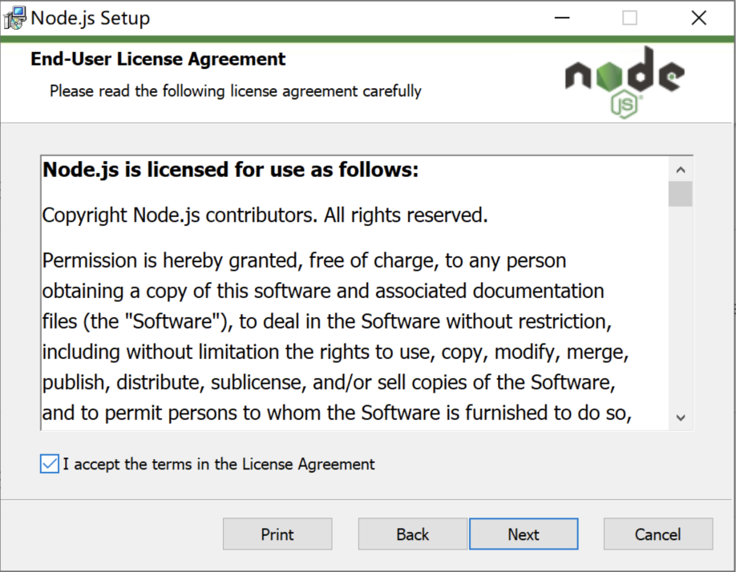
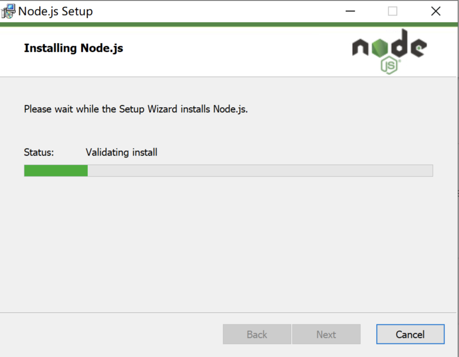
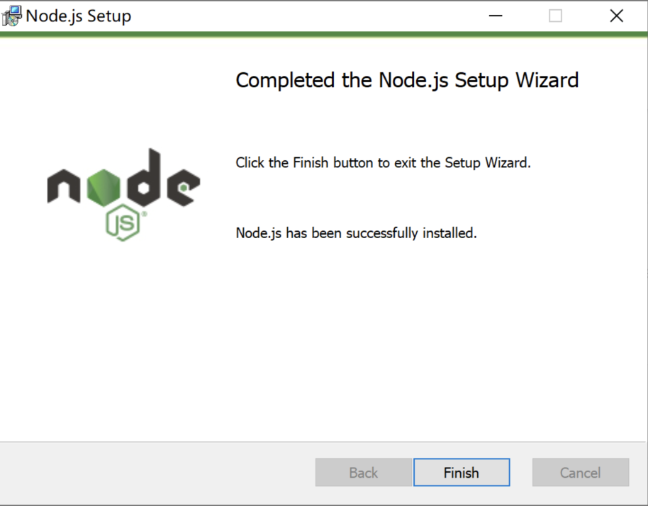

## 一 . PyExecJS模块

pyexecjs是一个可以帮助我们运行js代码的一个第三方模块.  其使用是非常容易上手的. 

但是它的运行是要依赖能运行js的第三方环境的. 这里我们选择用node作为我们运行js的位置. 

### 1.1 安装Nodejs










切记. 重启pycharm或者重启电脑. 

### 1.2 安装pyexecjs

```
pip install pyexecjs
```

测试一下:

````python
import execjs

print(execjs.get().name)  # 需要重启pycharm或者重启电脑 Node.js (V8)
````

### 1.3 简单使用

```python
import execjs

print(execjs.get().name)

# execjs.eval 可以直接运行js代码并得到结果
js = """
    "鲁班_王昭君_猴子_亚瑟_蔡文姬".split("_")
"""
res = execjs.eval(js)
print(res)

# execjs.compile(),  call()
# execjs.compile() 事先加载好一段js代码,
jj = execjs.compile("""
    function an(a, b){
        return a + b    
    }
""")
# call() 运行代码中的xxx函数. 后续的参数是xxx的参数
ret = jj.call("an", 10, 20)
print(ret)
```

windows中如果出现编码错误. 在引入execjs之前. 插入以下代码即可.

```python
import subprocess
from functools import partial
subprocess.Popen = partial(subprocess.Popen, encoding='utf-8')

import execjs
```

完事儿.  你没有看错. execjs就这几个功能就够咱用的了. 


### 1.4 实战案例(调试工具)（详情见视频案例）