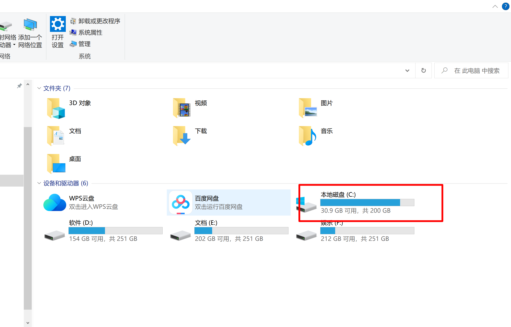
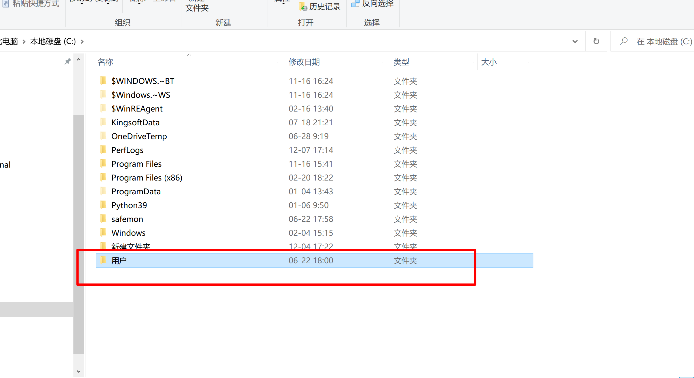
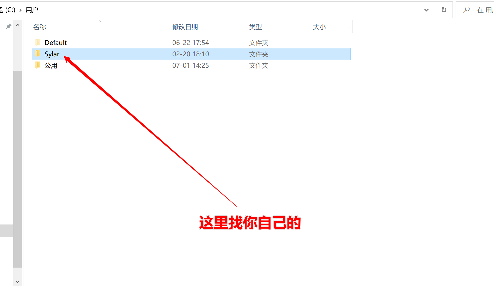
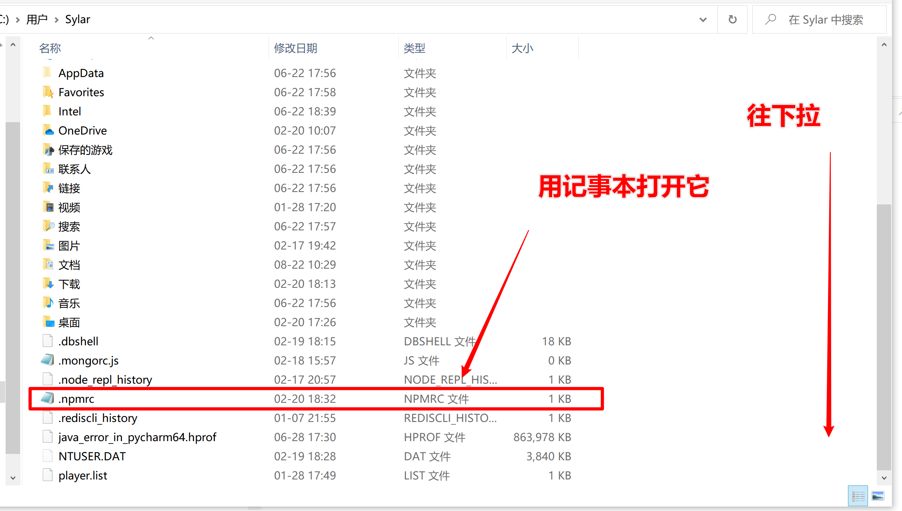
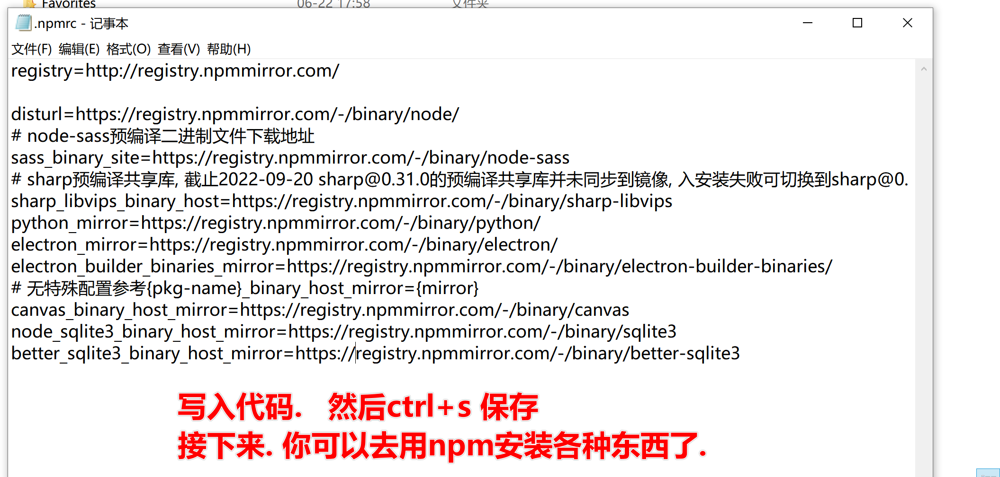

# 更换npm为国内镜像

在终端执行.  

```
npm set registry http://registry.npmmirror.com
```


首先, 打开"我的电脑". 找到"c盘中用户文件夹". 找到你当前正在使用的"用户"













代码如下. 

```
registry=http://registry.npmmirror.com/

disturl=https://registry.npmmirror.com/-/binary/node/
# node-sass预编译二进制文件下载地址
sass_binary_site=https://registry.npmmirror.com/-/binary/node-sass
# sharp预编译共享库, 截止2022-09-20 sharp@0.31.0的预编译共享库并未同步到镜像, 入安装失败可切换到sharp@0.30.7使用
sharp_libvips_binary_host=https://registry.npmmirror.com/-/binary/sharp-libvips
python_mirror=https://registry.npmmirror.com/-/binary/python/
electron_mirror=https://registry.npmmirror.com/-/binary/electron/
electron_builder_binaries_mirror=https://registry.npmmirror.com/-/binary/electron-builder-binaries/
# 无特殊配置参考{pkg-name}_binary_host_mirror={mirror}
canvas_binary_host_mirror=https://registry.npmmirror.com/-/binary/canvas
node_sqlite3_binary_host_mirror=https://registry.npmmirror.com/-/binary/sqlite3
better_sqlite3_binary_host_mirror=https://registry.npmmirror.com/-/binary/better-sqlite3
```


附赠: 

​	npm官方库搜索:  https://www.npmjs.com/

​	JS语法规则:https://developer.mozilla.org/zh-CN/docs/Web/JavaScript/Reference

​	rsa.js很古老的一个库   https://ohdave.com/rsa/